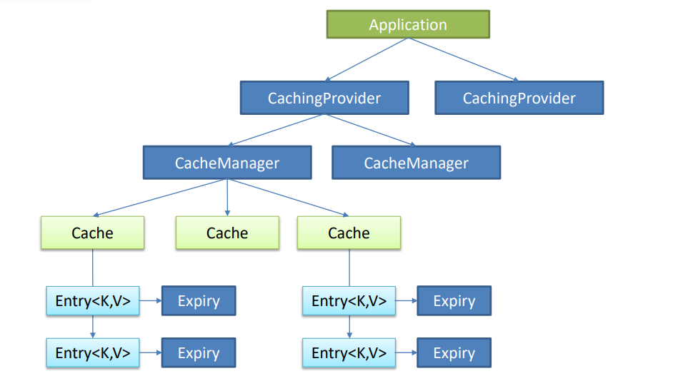
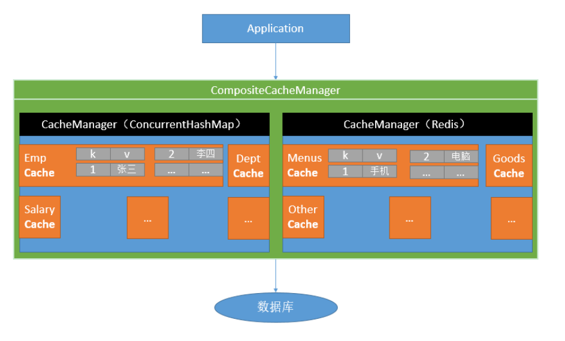
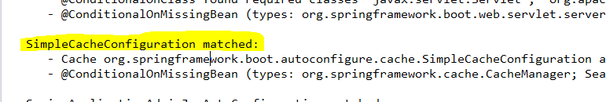

# Spring-boot高级

## 一、缓存

### 1、JSR107

​	（Java Specification Requests，Java 规范提案 ）

​	Java Caching定义了5个核心接口，分别是CachingProvider, CacheManager, Cache, Entry 和 Expiry。 

> -  **CachingProvider：**定义了创建、配置、获取、管理和控制多个CacheManager。一个应用可 以在运行期访问多个CachingProvider。 
> - **CacheManager：**定义了创建、配置、获取、管理和控制多个唯一命名的Cache，这些Cache 存在于CacheManager的上下文中。一个CacheManager仅被一个CachingProvider所拥有。
> -  **Cache：**是一个类似Map的数据结构并临时存储以Key为索引的值。一个Cache仅被一个 CacheManager所拥有。 
> - Entry是一个存储在Cache中的key-value对。 
> -  **Expiry：** 每一个存储在Cache中的条目有一个定义的有效期。一旦超过这个时间，条目为过期 的状态。一旦过期，条目将不可访问、更新和删除。缓存有效期可以通过ExpiryPolicy设置。 

**使用需导入包**

```xml
<dependency>
    <groupId>javax.cache</groupId>
    <artifactId>cache-api</artifactId>
</dependency>
```

**基于JSR107，图示大致的应用访问cache流程**



### 2、Spring缓存抽象

​	Spring从3.1开始定义了org.springframework.cache.Cache 和org.springframework.cache.CacheManager接口来统一不同的缓存技术； 并支持使用JCache（JSR-107）注解简化我们开发

> - Cache接口为缓存的组件规范定义，包含缓存的各种操作集合；
>
> -  Cache接口下Spring提供了各种xxxCache的实现；如RedisCache，EhCacheCache , ConcurrentMapCache等；
>
> -  每次调用需要缓存功能的方法时，Spring会检查检查指定参数的指定的目标方法是否 已经被调用过；如果有就直接从缓存中获取方法调用后的结果，如果没有就调用方法 并缓存结果后返回给用户。下次调用直接从缓存中获取。
>
> -  使用Spring缓存抽象时我们需要关注以下两点； 
>
>   1、确定方法需要被缓存以及他们的缓存策略
>
>   2、从缓存中读取之前缓存存储的数据 

**使用springcache后流程**



### 3、概念&缓存注解

| cache          | 缓存接口，定义缓存操作。实现有：RedisCache、EhCacheCache、 ConcurrentMapCache等 |
| -------------- | ------------------------------------------------------------ |
| CacheManager   | 缓存管理器，管理各种缓存（Cache）组件                        |
| @Cacheable     | 主要针对方法配置，能够根据方法的请求参数对其结果进行缓存     |
| @CacheEvict    | 清空缓存                                                     |
| @CachePut      | 保证方法被调用，又希望结果被缓存。                           |
| @EnableCaching | 开启基于注解的缓存                                           |
| keyGenerator   | 缓存数据时key生成策略                                        |
| serialize      | 缓存数据时value序列化策略                                    |

#### **@Cacheable/@CachePut/@CacheEvict 主要的参数** 

| value                           | 缓存的名称，在 spring 配置文件中定义，必须指定 至少一个      | 例如： @Cacheable(value=”mycache”) 或者 @Cacheable(value={”cache1”,”cache2”} |
| ------------------------------- | ------------------------------------------------------------ | ------------------------------------------------------------ |
| key                             | 缓存的 key，可以为空，如果指定要按照 SpEL 表达 式编写，如果不指定，则缺省按照方法的所有参数 进行组合 | 例如： @Cacheable(value=”testcache”,key=”#userName”)         |
| condition                       | 缓存的条件，可以为空，使用 SpEL 编写，返回 true 或者 false，只有为 true 才进行缓存/清除缓存，在 调用方法之前之后都能判断 | 例如： @Cacheable(value=”testcache”,condition=”#userNam e.length()>2”) |
| allEntries (@CacheEvict )       | 是否清空所有缓存内容，缺省为 false，如果指定为 true，则方法调用后将立即清空所有缓存 | 例如： @CachEvict(value=”testcache”,allEntries=true)         |
| beforeInvocation (@CacheEvict)  | 是否在方法执行前就清空，缺省为 false，如果指定 为 true，则在方法还没有执行的时候就清空缓存， 缺省情况下，如果方法执行抛出异常，则不会清空 缓存 | 例如： @CachEvict(value=”testcache”， beforeInvocation=true) |
| unless (@CachePut) (@Cacheable) | 用于否决缓存的，不像condition，该表达式只在方 法执行之后判断，此时可以拿到返回值result进行判 断。条件为true不会缓存，fasle才缓存 | 例如： @Cacheable(value=”testcache”,unless=”#result == null”) |

#### **Cache SpEL available metadata** 

| 名字          | 位置               | 描述                                                         | 示例                  |
| ------------- | ------------------ | ------------------------------------------------------------ | --------------------- |
| methodName    | root object        | 当前被调用的方法名                                           | \#root.methodName     |
| method        | root object        | 当前被调用的方法                                             | \#root.method.name    |
| target        | root object        | 当前被调用的目标对象                                         | \#root.target         |
| targetClass   | root object        | 当前被调用的目标对象类                                       | \#root.targetClass    |
| args          | root object        | 当前被调用的方法的参数列表                                   | \#root.args[0]        |
| caches        | root object        | 当前方法调用使用的缓存列表（如@Cacheable(value={"cache1", "cache2"})），则有两个cache | \#root.caches[0].name |
| argument name | evaluation context | 方法参数的名字. 可以直接 #参数名 ，也可以使用 #p0或#a0 的 形式，0代表参数的索引； | \#iban 、 #a0 、 #p0  |
| result        | evaluation context | 方法执行后的返回值（仅当方法执行之后的判断有效，如 ‘unless’，’cache put’的表达式 ’cache evict’的表达式 beforeInvocation=false） | \#result              |

### 4、缓存使用

**环境配置：**

```java
/*
 *	一、搭建基本环境
 *	1、导入数据库文件，创建department与employee表
 *	2、创建javabean封装数据
 *	3、整合mybatis操作数据库
 *		1、配置数据源信息
 *		2、使用注解版mybatis
 *	二、使用缓存
 *	1、开启基于注解的缓存 @EnableCaching
 *	2、标注缓存注解即可
 *		@Cacheable
 *		@CacheEvict
 *		@CachePut
 */
@EnableCaching
@MapperScan("com.lov.mapper") 	SpringbootCacheApplication
-------------------------------------------------------
/*
* 	将方法的运行结果进行缓存，之后再要相同的 数据，直接从缓存中获取，不需要调用方法
* 
* 	CacheManager管理多个Cache组件，对缓存的真正crud操作在cache组件中，每一个缓存组件有自己唯一的名字；
* 	属性：
* 		cacheNames/value:指定缓存组件的名字
* 		key:缓存数据使用的key；默认是使用方法参数的值，
* 		key/keyGenerator:key的生成器，可以自己指定key的生成器的组件id
* 		cacheManager:指定缓存管理器；或者cacheResolver指定获取解析器
* 		condition:指定符合条件的情况下才缓存
* 		unless:否定缓存；当unless指定条件为true时，方法返回值不会被缓存
* 		sync:是否使用异步模式
*/
	@Cacheable(cacheNames={"emp"},key="#root.methodName+'['+#id+']'")	//key=getEmp[1]
	public Employee getEmp(Integer id) { 	EmployeeService
```

​	1、引入spring-boot-starter-cache模块

​	2、@EnableCaching开启缓存

​	3、使用缓存注解

​	4、切换为其他缓存

#### 原理

**1、自动配置类**：CacheAutoConfiguration

```java
@Configuration
@ConditionalOnClass(CacheManager.class)
@ConditionalOnBean(CacheAspectSupport.class)
@ConditionalOnMissingBean(value = CacheManager.class, name = "cacheResolver")
@EnableConfigurationProperties(CacheProperties.class)
@AutoConfigureAfter({ CouchbaseAutoConfiguration.class, HazelcastAutoConfiguration.class,
		HibernateJpaAutoConfiguration.class, RedisAutoConfiguration.class })
@Import(CacheConfigurationImportSelector.class)
public class CacheAutoConfiguration {
-----------------------------------------------------
    CacheConfigurationImportSelector.class
    /**
	 * {@link ImportSelector} to add {@link CacheType} configuration classes.
	 */
    static class CacheConfigurationImportSelector implements ImportSelector {

		@Override
		public String[] selectImports(AnnotationMetadata importingClassMetadata) {
			CacheType[] types = CacheType.values();
			String[] imports = new String[types.length];
			for (int i = 0; i < types.length; i++) {
				imports[i] = CacheConfigurations.getConfigurationClass(types[i]);
			}
			return imports;	//返回所有自动导入的各种cache类型配置类
		}

	}
```

**2、缓存的配置类**

return imports;

```properties
org.springframework.boot.autoconfigure.cache.GenericCacheConfiguration
org.springframework.boot.autoconfigure.cache.JCacheCacheConfiguration
org.springframework.boot.autoconfigure.cache.EhCacheCacheConfiguration
org.springframework.boot.autoconfigure.cache.HazelcastCacheConfiguration
org.springframework.boot.autoconfigure.cache.InfinispanCacheConfiguration
org.springframework.boot.autoconfigure.cache.CouchbaseCacheConfiguration
org.springframework.boot.autoconfigure.cache.RedisCacheConfiguration
org.springframework.boot.autoconfigure.cache.CaffeineCacheConfiguration
org.springframework.boot.autoconfigure.cache.SimpleCacheConfiguration
org.springframework.boot.autoconfigure.cache.NoOpCacheConfiguration
```

默认导入的是**SimpleCacheConfiguration**



**3、给容器注册一个CacheManger：ConcurrentMapCacheManger**

**4、可以获取和创建ConcurrentMapCache类型的缓存组件**	

#### 运行流程

==**@Cacheable**==

**1、方法运行前，前去查询Cache（缓存组件），按照cacheNames指定的名字获取；（CacheManager先获取相应的缓存），第一次获取缓存如果没有Cache组件会自动创建**

**2、去Cache中查找缓存的内容，使用一个key，默认就是方法的参数**

```java
SimpleKeyGenerator：
/*
	key是按照某种策略生成的；默认是使用keyGenerator生成的，默认使用SimpleKeyGenerator生成key；

	SimpleKeyGenerator生成key的默认策略：

		如果没有参数：key=new SimpleKey()

		如果有一个参数：key=参数的值

		如果有多个参数：key=new SimpleKey(params)
*/

	/**
	 * Generate a key based on the specified parameters.
	 */
	public static Object generateKey(Object... params) {
		if (params.length == 0) {
			return SimpleKey.EMPTY;
		}
		if (params.length == 1) {
			Object param = params[0];
			if (param != null && !param.getClass().isArray()) {
				return param;
			}
		}
		return new SimpleKey(params);
	}

```

**3、没有查到缓存就调用目标方法**

**4、将目标方法返回的结果，放入缓存中**

==**@Cacheable **标注的方法执行之前先来检查缓存中有没有这个数据，默认按照参数的值作为key去查询缓存。如果没有就运行方法并将结果放入缓存；之后再调用就可以直接使用缓存中的数据==

**核心**

​	1、使用CacheManager按照名字得到Cache组件

​	2、key使用keyGenerator生成的，默认时SimpleKeyGenerator

#### @Cacheable属性使用 

##### keyGenerator

```java
@Configuration
public class MyCacheConfig {

	@Bean("myKeyGenerator")
	public KeyGenerator keyGenerator() {
		return ( target,  method, params)->{
			return method.getName()+"{"+params[0].toString()+"}";
			};
	}
	
	
}
------------------------------------------------------
	@Cacheable(cacheNames= {"emp"},keyGenerator="myKeyGenerator")
```

**condition**

```java
//第一个参数的值大于1才缓存
@Cacheable(cacheNames= {"emp"},condition="#a0>1")
```

**unless**

```java
//第一个参数的值等于2不缓存
@Cacheable(cacheNames= {"emp"},unless="#a0=2")
```

#### @CachePut

```java
	/*
	 * @CachePut：既调用方法，又更新缓存数据；同步更新缓存
	 * 	修改了数据库的某个数据，同时更新缓存
	 * 	运行时机：
	 * 	1、先调用目标方法
	 * 	2、将目标方法的结果缓存起来
	 * 
	 * 	测试：
	 * 	1、查询1号emp，查到结果放入缓存： key：1,value: emp
	 * 	2、更新1号emp：
	 * 		将方法的返回值放入缓存：key：传入的emp对象	,value: emp
	 * 	3、查询还是之前的值：由于两者key不一致
	 * 		更新：
	 * 			key="#employee.id"	使用传入的参数
	 * 			key="#result.id"	使用返回的结果
	 */
	@CachePut(value="emp",key="#employee.id")
	public Employee updateEmp(Employee employee) {
		System.out.println("updateEmp:"+employee 	);
		employeeMapper.updateEmp(employee);
		return employee;
	}
```

#### @CacheEvict

```java
/*
	 * @CacheEvit:缓存清除
	 * 	key：指定要清除的数据
	 * 	allEntries=tue:指定清除所有数据
	 * 	beforeInvocation=false:缓存的清除是否在方法之前执行
	 * 		默认代表在方法执行之后执行，如果出现异常缓存不会被清除；为true时无论怎样都会清除
	 */
	@CacheEvict(value="emp",key="#id")
	public void deleteEmp(Integer id) {
		System.out.println("deleteEmp:"+id);
//		employeeMapper.deleteEmpByid(id);
	}
```

#### @Caching& @CacheConfig

```java

@CacheConfig(cacheNames="emp")	//抽取缓存的公共配置
@Service
public class EmployeeService {
	...............
	@Caching(	//多个cache的结合使用
			cacheable= {
					@Cacheable(key="#lastName")
			},
			put= {
					@CachePut(key="#result.email"),
					@CachePut(key="#result.id")
			}
			)
	public Employee getEmpByLastName(String lastName) {
		return employeeMapper.getEmpByLastName(lastName);
	}
-----------------------------------------------
    public @interface Caching {

	Cacheable[] cacheable() default {};

	CachePut[] put() default {};

	CacheEvict[] evict() default {};

}
```

### 5、整合Redis实现缓存

​	1、引入spring-boot-starter-data-redis

​	2、application.yml配置redis连接地址 

​	3、使用RestTemplate操作redis

​		redisTemplate.opsForValue();//操作字符串 		

​		redisTemplate.opsForHash();//操作hash 

​		redisTemplate.opsForList();//操作list 

​		redisTemplate.opsForSet();//操作set 

​		redisTemplate.opsForZSet();//操作有序set 

​	4、配置缓存、CacheManagerCustomizers

​	5、测试使用缓存、切换缓存、 CompositeCacheManager 

## 二、消息

## 三、检索

## 四、任务

## 五、安全

## 六、分布式

## 七、监控管理

## 八、部署